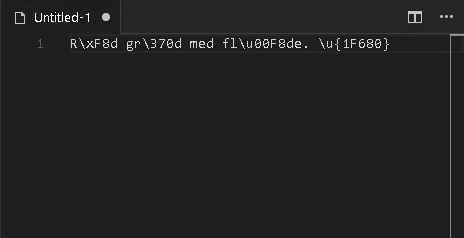

# escaping-characters

This extensions adds escape/unescape methods for [JavaScript special characters](https://developer.mozilla.org/en-US/docs/Web/JavaScript/Guide/Grammar_and_types#Using_special_characters_in_strings):

| Syntax     | Description                                                                                                                                                                    |
|------------|--------------------------------------------------------------------------------------------------------------------------------------------------------------------------------|
| \\XXX      | The character with the Latin-1 encoding specified by up to three octal digits XXX between 0 and 377. For example, \\251 is the octal sequence for the copyright symbol.        |
| \\xXX      | The character with the Latin-1 encoding specified by the two hexadecimal digits XX between 00 and FF. For example, \\xA9 is the hexadecimal sequence for the copyright symbol. |
| \\uXXXX    | The Unicode character specified by the four hexadecimal digits XXXX. For example, \\u00A9 is the Unicode sequence for the copyright symbol. See Unicode escape sequences.      |
| \\u{XXXXX} | Unicode code point escapes. For example, \\u{2F804} is the same as the simple Unicode escapes \\uD87E\\uDC04.                                                                  |

This is the README for your extension "escaping-characters". After writing up a brief description, we recommend including the following sections.

## Known Issues

Coming soon...

## Release Notes

### 1.0.0

Initial release.

## Thanks

This is more or less a fork of [yaruson/ascii-unicode-escape](https://github.com/yaruson/ascii-unicode-escape) which in turn is a fork of [renatoferreira656/ascii-unicode-escape](https://github.com/renatoferreira656/ascii-unicode-escape).
Credits to these guys for the initial work!